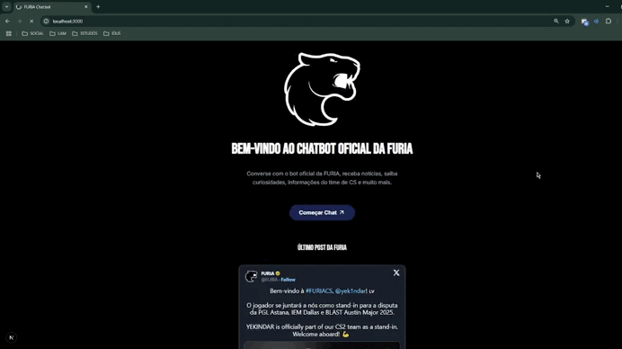
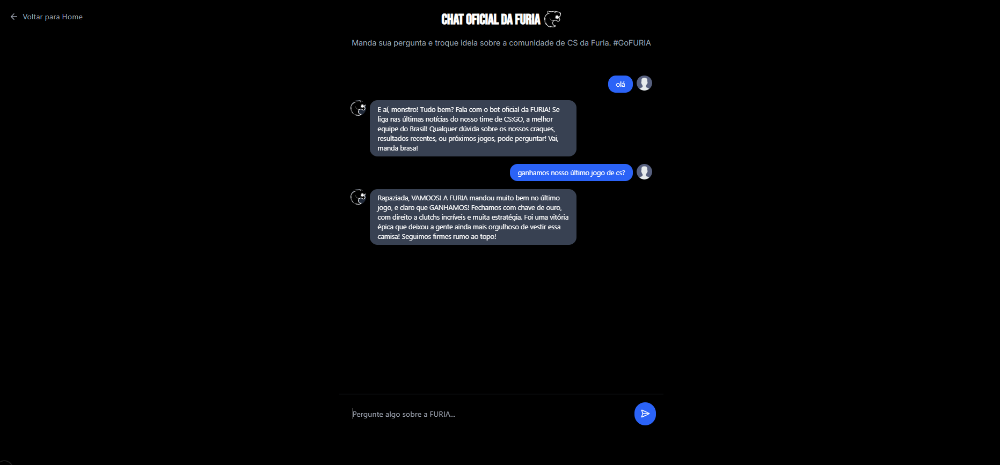

  # FURIA Chatbot 🐆🔥

- Bem-vindo ao FURIA Chatbot, um projeto desenvolvido pro Challenge #1 - Experiência Conversacional FURIA! Este é um chatbot interativo com uma homepage, posts do Twitter da FURIA, e localStorage pra salvar mensagens do chat. Feito com a energia do time de esports mais brabo do Brasil! 🚀

- O FURIA Chatbot é uma aplicação web que conecta os fãs da FURIA Esports com um bot conversacional. A homepage engaja com um design gamer (laranja, preto, branco), enquanto o chat usa localStorage pra persistir mensagens. Criado pro challenge, combina UX imersiva com tech moderna.

## 🎮 Funcionalidades

- **Chat com IA**: Bot conversacional com Gemini API pra respostas dinâmicas.

- **Feed do Twitter**: Últimos posts da @furia via react-tweet.

- **Chat Interativo**: Bot conversacional com mensagens salvas no localStorage.

- **Botão Animado**: CTA “Começar Chat” com framer-motion e animate-pulse.

- **Footer Social**: Links pro Twitter e Instagram da FURIA.

- **Responsividade**: Perfeito em mobile e desktop com Tailwind 4.

-  **Persistência**: Mensagens salvas no localStorage.

## 📸 Screenshots

- ### Homepage

  

- ### Chat

## 🛠️ Tech Stack

- **Frontend**: Next.js 15, React 19, TypeScript
  
- **API**: Google Gemini
  
- **Estilização**: Tailwind CSS 4.0

- **Animações**: Framer Motion

- **Ícones**: Lucide React

- **Integração Social**: React Tweet

- **Persistência**: localStorage

## 🚀 Como Rodar Localmente

- Clone o repositório:

   `git clone https://github.com/seu-usuario/furia-chatbot.git`
 
   `cd furia-chatbot`

- Instale as dependências:

  `npm install`

- Rode o projeto:

  `npm run dev`

- Abra `http://localhost:3000` no navegador.

## 🚀 Demonstração do projeto

- **Link do projeto**:

## 🙌 Créditos

- **FURIA Esports**: Inspiração e branding 🐆

- **Challenge #1**: Motivação pra criar algo épico

- **Desenvolvedor**: João Pedro de Medeiros

VAMOOO FURIA! 🐆🔥
